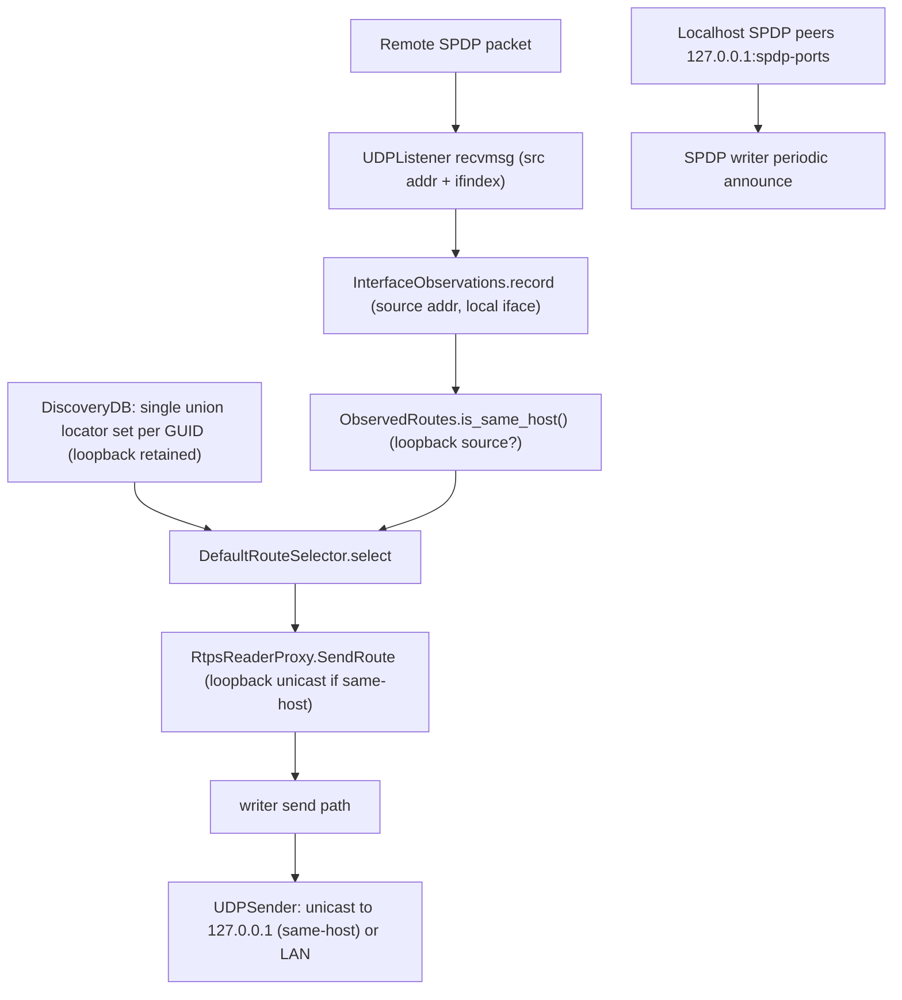

# Same-Host Communication over Loopback

Status: implemented. See Section 11 for the as-built notes.

This document describes how RustDDS can prefer the local loopback interface for
communication between two participants on the same host, including when there is
no external network at all, while never sending loopback traffic to off-host
peers.

The relevant code today lives in
[`transmit.rs`](transmit.rs) (`InterfaceObservations`, `SendRoute`,
`DefaultRouteSelector`),
[`rtps_reader_proxy.rs`](rtps_reader_proxy.rs) and `rtps_writer_proxy.rs`
(per-peer locator lists, current loopback filtering),
[`writer.rs`](writer.rs) (route resolution hooks),
[`../discovery/discovery.rs`](../discovery/discovery.rs) (SPDP publish),
[`../discovery/spdp_participant_data.rs`](../discovery/spdp_participant_data.rs)
(advertised locators),
[`../network/util.rs`](../network/util.rs) (interface enumeration / self
locators), and
[`../dds/participant.rs`](../dds/participant.rs) (listener setup).

## 1. Purpose and scope

Make same-host participant-to-participant communication:

- prefer the loopback interface (large MTU, no NIC dependency, lower latency),
- work even with no external network (no usable NIC, no multicast), and
- never leak loopback traffic onto the wire to off-host peers,

while staying within the standard RTPS discovery data model (one participant
record per GUID prefix) and reusing the existing interface-aware transmit
machinery.

This is *not* a per-interface-differentiated-SPDP design. We advertise a single
locator set (the union of all interfaces, exactly as today) and decide whether
to *use* the loopback locator based on the interface the peer's traffic actually
arrived on. See Section 6 for why differentiated advertising was rejected.

Scope of this document is design only. No behavior changes are implied by
merging it.

## 2. Current behavior (baseline)

The building blocks are mostly present; loopback is advertised and received but
then deliberately discarded.

- **Loopback is already advertised.** `self_locators` are built from every
  enumerated interface with no loopback filter
  ([`../network/util.rs`](../network/util.rs)
  `get_local_unicast_locators_inner`), so `127.0.0.1` is already part of the
  `metatraffic_unicast_locators` and `default_unicast_locators` published in SPDP
  ([`../discovery/spdp_participant_data.rs`](../discovery/spdp_participant_data.rs)
  `from_local_participant`).
- **Loopback is already received.** The unicast metatraffic and user-traffic
  listeners bind `0.0.0.0` ([`../dds/participant.rs`](../dds/participant.rs), the
  `UDPListener::new_unicast_with_buf_size("0.0.0.0", ...)` calls), so a single
  socket already receives both loopback and LAN datagrams. No separate loopback
  listener is required to receive over loopback.
- **The receiving interface is already observed.** `InterfaceObservations` /
  `ObservedRoutes` ([`transmit.rs`](transmit.rs)) record, per remote participant,
  the local interface and source address its traffic arrived on (populated from
  `IP_PKTINFO`). This is per-participant and is exactly the "we can see the same
  remote is reachable via loopback" signal we need.
- **A per-reader route abstraction already exists.** `SendRoute` /
  `RouteSelector` / `DefaultRouteSelector` ([`transmit.rs`](transmit.rs)) choose a
  single unicast/multicast destination per reader, with a safe `fallback` to the
  legacy all-locators path.
- **Loopback is then thrown away.** Discovered loopback locators are dropped
  unconditionally in `RtpsReaderProxy::from_discovered_reader_data` / `update`
  (`unicast_locator_list.retain(Self::not_loopback)`,
  [`rtps_reader_proxy.rs`](rtps_reader_proxy.rs) ~132 and ~244), and
  `DefaultRouteSelector` filters `!l.is_loopback()` in both `first_reachable_udp`
  and `select_unicast` ([`transmit.rs`](transmit.rs) ~254, ~309).
- **SPDP announce is a single payload to all destinations.** `spdp_publish`
  ([`../discovery/discovery.rs`](../discovery/discovery.rs) ~1417) does one
  `dcps_participant.writer.write(data, None)`; the built-in writer sends identical
  content to the SPDP multicast group and to discovered peers' metatraffic
  locators.
- **There is no unicast initial-peers / localhost discovery mechanism.**
  Discovery relies on the well-known multicast group `239.255.0.1`. With no NIC
  (or with loopback multicast disabled — the Linux default for `lo`), no SPDP is
  exchanged and same-host discovery never happens.

## 3. Problems

- Loopback is advertised and received but never used, so same-host traffic goes
  over the NIC even when both participants are local.
- Same-host communication is impossible with no external network, because
  discovery depends on NIC multicast.
- The `not_loopback` filter is a blunt instrument: it protects against sending to
  a remote host's `127.0.0.1`, but it also prevents the legitimate same-host use.

## 4. Proposed design: advertise the union, decide by arrival interface

The core idea: keep advertising one locator set (the union, as today), and gate
the *use* of loopback on a positive "same-host" observation. Because application
data already flows through `SendRoute`, once route selection picks a loopback
locator the user data rides loopback automatically — **no per-interface send
capability is needed for application data.**

### 4.1 Loopback discovery transport (enables no-external-network)

Advertising is not enough; SPDP must physically travel over loopback for
same-host discovery to work without a NIC.

- Add a **localhost unicast SPDP peers** list, default
  `127.0.0.1:{spdp_well_known_unicast_port(domain, pid)}` for
  `pid in 0..N` (small N, e.g. the same 0..120 range the participant-id search
  already uses, capped to a sane default like 0..10). Have the SPDP built-in
  writer send its periodic announce to these locators in addition to multicast.
- This is the standard "unicast discovery peers = localhost" trick (CycloneDDS
  `Peers`, FastDDS initial peers) and makes same-host discovery fully independent
  of multicast.
- Implementation options: add these as synthetic reader-proxy destinations on the
  SPDP writer, or maintain a small "always-send-to" initial-peers locator list
  consulted in the SPDP send path. This is *transport only* — the payload is
  unchanged (still the union locator set).
- Optionally also attempt loopback multicast where supported; treat failure as
  non-fatal (unicast localhost peers are the reliable path).

### 4.2 Preserve loopback locators through discovery

Stop discarding loopback unconditionally, but keep it gated so it is never *used*
to reach an off-host peer.

- Change `RtpsReaderProxy::from_discovered_reader_data` / `update`
  ([`rtps_reader_proxy.rs`](rtps_reader_proxy.rs) ~132, ~244) and the
  `RtpsWriterProxy` equivalent to retain loopback locators (either keep them in
  the normal list, or in a dedicated `loopback_unicast_locators` bucket so the
  gating is explicit and the legacy list stays loopback-free).
- The writer-proxy side matters too: it governs where ACKNACK/NACK_FRAG replies
  are sent, so same-host reliable traffic in the reverse direction also benefits.

### 4.3 Same-host detection

Add a positive same-host signal driven by the observations we already collect.

- Extend `ObservedRoutes` ([`transmit.rs`](transmit.rs)) with an
  `is_same_host()` predicate. The simplest robust signal is: the participant's
  traffic arrived from a **loopback source address** (`SocketAddr::ip().is_loopback()`),
  and/or on the loopback local interface. `InterfaceObservations::record` already
  receives the source `SocketAddr`, so this is a small, self-contained addition.
- Same-host is a sticky, monotonic-ish property: once positively observed it
  should persist (subject to participant-lost cleanup), because a same-host peer
  will keep reaching us over loopback.

### 4.4 Route selection prefers loopback

Extend `DefaultRouteSelector::select` ([`transmit.rs`](transmit.rs)):

- If the peer is confirmed same-host **and** advertised a loopback unicast
  locator, return
  `SendRoute { unicast: <loopback locator>, multicast: None, fallback: false }`,
  giving loopback top priority over any LAN locator.
- Otherwise behave exactly as today (loopback filtered out; never sent across the
  wire). This preserves the safety property the `not_loopback` filter was added
  for.
- Provide a fallback to the LAN route if the loopback path later goes silent,
  reusing the existing sticky hysteresis (`STICKY_SWITCH_MARGIN`) so a transient
  gap does not flap the route.

### 4.5 Interaction with per-peer MTU

The recently landed per-peer path-MTU work resolves the datagram budget from the
egress interface ([`../network/util.rs`](../network/util.rs)
`path_mtu_payload_for_peer` via `RtpsReaderProxy::resolve_path_mtu`). A loopback
route naturally matches the loopback interface's (large) MTU, so same-host
packing gets the big-MTU benefit for free once the loopback locator is chosen.

### 4.6 Recompute triggers

Reuse the existing route-resolution hook points — no new triggers are needed:

- `matched_reader_update` on discovery add/update, and
  `Writer::recompute_routes_for` on fresh SPDP traffic ([`writer.rs`](writer.rs)),
  which already call `resolve_path_mtu` and route selection.
- Same-host status is an input to `select`, so it is picked up on the same
  recompute path whenever a new observation arrives.

## 5. Data flow

## 6. Rejected alternative: per-interface differentiated advertising

The originally proposed mechanism — send a loopback-only SPDP over the loopback
interface and a public-only SPDP over the NIC, then correlate the two records —
was rejected:

- **RTPS discovery is keyed by participant GUID prefix, not by
  (GUID, interface).** `update_participant`
  ([`../discovery/discovery_db.rs`](../discovery/discovery_db.rs)) keeps one
  `SpdpDiscoveredParticipantData` per prefix. Two SPDP messages for the same
  participant carrying different locator sets would overwrite each other every
  SPDP period (10 s), flip-flopping the record and churning reader/writer
  proxies. Making it stable requires unioning them and remembering which arrived
  where — which is exactly "advertise the union + `InterfaceObservations`" at a
  fraction of the complexity.
- **Per-egress SPDP content is a new, awkward writer capability.** An RTPS
  writer's DATA is destination-independent; only locators vary per reader.
  Emitting distinct SPDP samples per interface breaks the writer
  cache/heartbeat/sequence-number model (the same sequence number must not carry
  different content) and would need a bespoke SPDP sender outside the normal
  writer path.
- **The only benefit is cosmetic.** Not advertising `127.0.0.1` to off-host peers
  is nice, but they already ignore it (the `not_loopback` filter), so it is not
  worth the cost.

## 7. Correctness, fallbacks, compatibility

- **Never reach off-host over loopback.** Loopback is only ever *used* when a peer
  is positively confirmed same-host; absent that, behavior is identical to today.
- **Reachability is never reduced.** The localhost SPDP peers are *additional*
  destinations; multicast discovery is unchanged. If same-host detection fails,
  the peer is served over the NIC as before.
- **Interop.** Peers that advertise loopback (e.g. OpenDDS) are handled the same
  way: their loopback locator is only used if we observe them as same-host.
- **Platform notes.** `IP_PKTINFO`-based interface capture is Unix-only; on other
  platforms same-host detection relies on the loopback *source address*, which is
  still available via `recv_from`.

## 8. Configuration

- Add a participant-builder / QoS knob to enable/disable (a) loopback-preferred
  same-host communication and (b) localhost SPDP discovery peers. Default on, so
  locked-down or unusual environments can opt out.

## 9. Implementation plan (phased)

1. **Loopback discovery transport.** Add the localhost unicast SPDP peers list
   and send SPDP to it in addition to multicast
   ([`../discovery/discovery.rs`](../discovery/discovery.rs) `spdp_publish` / SPDP
   writer setup; port helper in
   [`../network/constant.rs`](../network/constant.rs)). Optional non-fatal
   loopback multicast attempt.
2. **Preserve loopback locators.** Stop the unconditional `not_loopback` drop in
   `RtpsReaderProxy` and the `RtpsWriterProxy` equivalent; keep loopback in a
   gated bucket.
3. **Same-host detection.** Add `ObservedRoutes::is_same_host()` in
   [`transmit.rs`](transmit.rs) from the loopback source address / receive
   interface.
4. **Route selection.** Extend `DefaultRouteSelector::select` to prefer the
   loopback unicast locator when same-host is confirmed, with LAN fallback via the
   existing hysteresis.
5. **Config + tests.** Participant-builder knob; unit tests (selector prefers
   loopback iff same-host; `update_participant` stable with union locators;
   same-host detection from loopback source); integration tests (two participants
   same host with NIC disabled discover and exchange data over loopback only; two
   participants on different hosts never use loopback).

## 10. Manual same-host validation

CI on a normal host exercises the happy path, but the "no external network" case
should be validated manually:

1. Disable all non-loopback interfaces (or run inside a network namespace with
   only `lo` up).
2. Run a reliable publisher and subscriber on the same host:
   - `shape_main -P -t Square -c BLUE -r`,
   - `shape_main -S -t Square -r`.
3. Expected: discovery converges via the localhost SPDP peers and DATA/HEARTBEAT
   flow over `127.0.0.1` (`tcpdump -ni lo0 udp` shows the exchange; the NIC shows
   nothing).
4. Re-enable the NIC and start a third participant on another host: the off-host
   peer is served over the NIC, and no loopback locator is ever sent to it.

## 11. Implementation notes (as built)

- **Loopback discovery transport.** `network::util::localhost_spdp_peer_locators`
  builds `127.0.0.1:spdp_well_known_unicast_port(domain, pid)` for
  `pid in 0..SPDP_LOCALHOST_PEER_COUNT` (default 12,
  [`../network/constant.rs`](../network/constant.rs)), skipping our own
  participant id. Rather than send differentiated SPDP, these are attached as
  fixed **extra unicast destinations** on the built-in SPDP writer
  (`Writer::extra_unicast_destinations`, wired in
  [`dp_event_loop.rs`](dp_event_loop.rs) `add_local_writer` only for
  `EntityId::SPDP_BUILTIN_PARTICIPANT_WRITER`). `send_message_to_readers` emits
  the same datagram to them unconditionally, de-duplicated against the normal
  sends. This keeps the advertised SPDP payload unchanged (still the union of
  locators) — it only adds send *destinations*.
- **Gated loopback bucket.** `RtpsReaderProxy` gained
  `loopback_unicast_locators`. `split_loopback` / `normalize_loopback` keep
  loopback out of `unicast_locator_list` (so the legacy all-locators fallback
  never targets a remote's loopback) while retaining it for route selection.
  `from_discovered_reader_data` and `update` split on the way in; a freshly
  inserted proxy (e.g. the inline built-in path) is normalized in
  `matched_reader_update`. `resolve_path_mtu` also scans the bucket so a
  loopback-only same-host peer inherits the large loopback MTU.
- **Same-host detection.** `ObservedRoutes::seen_from_loopback` is set (sticky)
  when any packet from a participant arrives from a loopback source address,
  exposed via `is_same_host()`.
- **Route selection.** `DefaultRouteSelector` carries
  `prefer_loopback_same_host` (default true). When set and the peer is
  same-host, `select` returns the advertised loopback unicast locator as the
  sole destination; otherwise it behaves exactly as before (loopback never
  selected). Application data rides this route with no extra machinery.
- **Config knob.** `DomainParticipantBuilder::same_host_loopback(bool)` (default
  true) threads through `DomainParticipantInner`/`DPEventLoop` to gate both the
  localhost SPDP peers and the loopback route preference (via
  `Writer::set_prefer_loopback_same_host`).
- **Not done (deliberately).** The `RtpsWriterProxy` reverse (ACKNACK) path was
  left unchanged: it never stripped loopback, so same-host reliable traffic
  already gets its control replies, and gating it would be a larger change with
  no data-path benefit.
- **Tests.** Unit tests cover same-host detection, loopback route preference
  (on/off), the non-same-host guard, the reader-proxy loopback split /
  normalize, and localhost-peer generation. The two same-host integration tests
  (`tests/late_endpoint_test.rs`) pass. (Loopback UDP is blocked by the build
  sandbox, so those must be run with full network access.)
