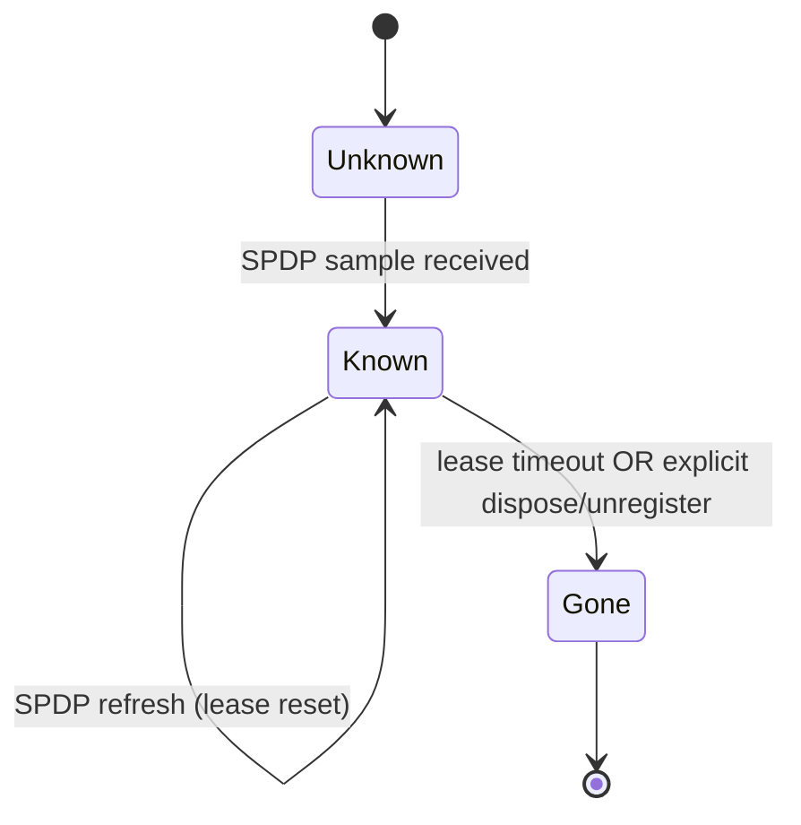
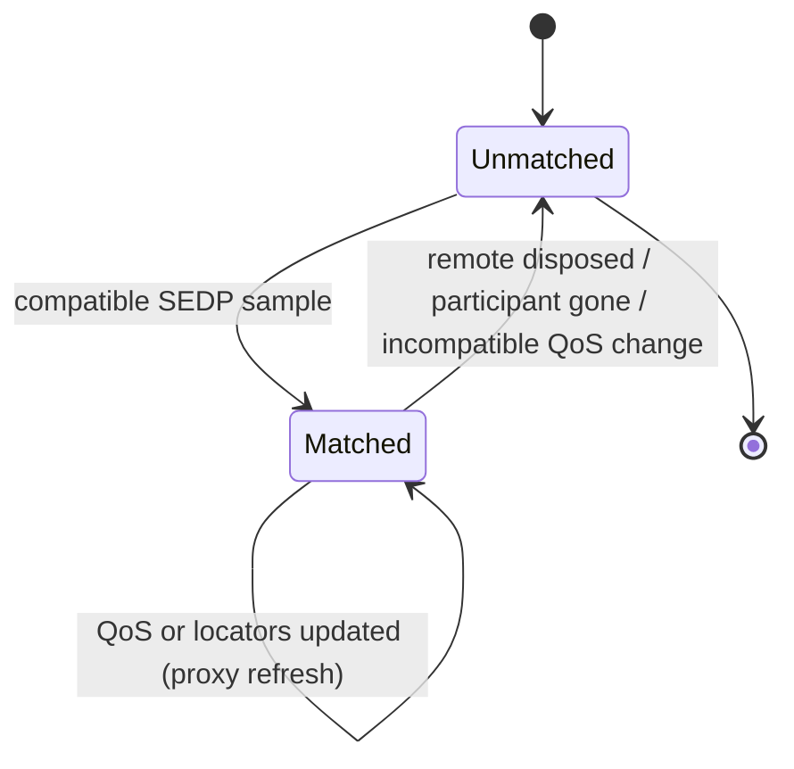
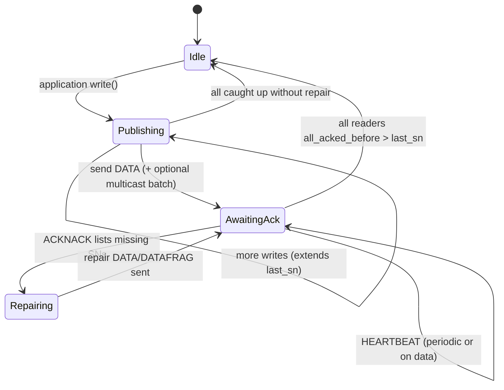
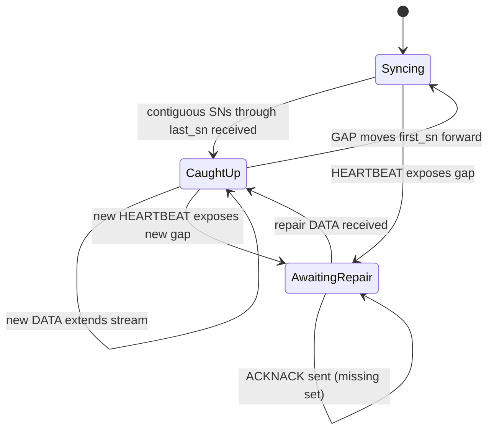
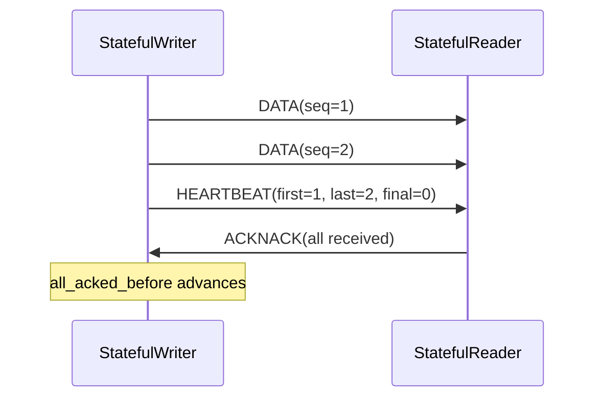
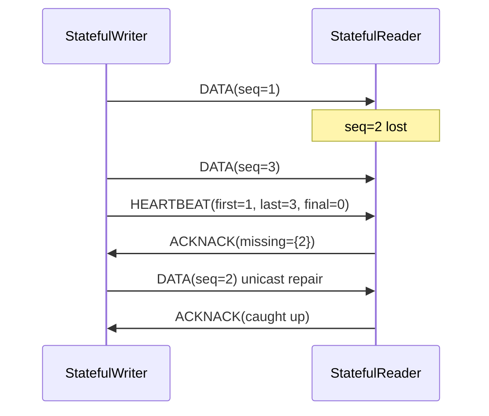
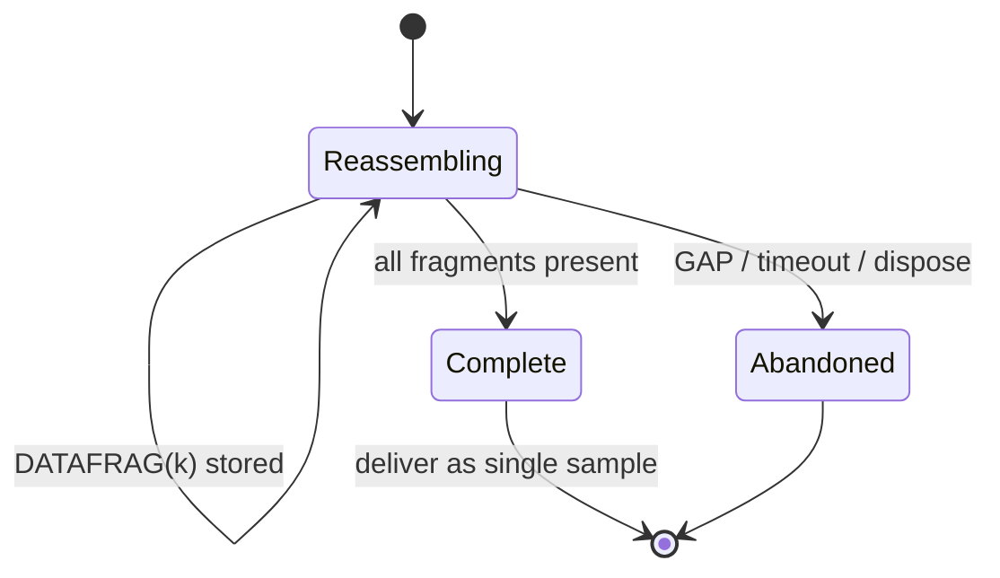

# RTPS Behavioral Specification (Condensed)

Status: reference note for implementers and reviewers.

This document describes **how RTPS participants and endpoint pairs interact**
over time: discovery, matching, data transfer, reliability repair, and teardown.
It is intentionally **not** a structural spec — field layouts, submessage
serialization, and entity-type tables belong in the OMG *DDS Interoperability
Wire Protocol* (DDSI-RTPS) specification. Here we capture the **protocol
dynamics** that matter when wiring readers, writers, and discovery together, plus
behaviors commonly seen in interoperable stacks (CycloneDDS, Fast DDS, RTI
Connext, and this implementation).

Normative baseline: **OMG DDSI-RTPS** (this note aligns with the 2.3/2.5
behavioral model; section numbers below refer to that document where helpful).

---

## 1. Scope and layering

```
  Application (DataWriter / DataReader, topics, QoS)
        |
        v
  DDS middleware (matching, caches, listeners, loaned samples)
        |
        v
  RTPS layer (Participants, Writers, Readers, discovery, wire protocol)
        |
        v
  Transport (typically UDP/IP unicast and multicast; optionally shared memory)
```

An **RTPS DomainParticipant** is the unit of process-level presence on the
wire. Everything below discovery matching happens between **endpoint pairs**
(Writer ↔ Reader) that share a compatible topic and QoS. A participant hosts
many endpoints; endpoints on different participants communicate only after both
participants have discovered each other and their endpoints have been matched.

**GUID** identity is hierarchical: a participant prefix (from discovery) plus an
entity id (writer/reader/builtin). All behavioral state below is keyed by
`(writer_guid, reader_guid)` or by `participant_guid_prefix` for discovery.

---

## 2. Discovery: participants find each other (SPDP)

SPDP is metatraffic: built-in **Participant** data samples announce *who is on
the network* and *where to reach them*.

### 2.1 What each participant publishes

Periodically and on startup, a participant sends **SPDP** samples describing:

- its GUID prefix and vendor/protocol version;
- **locators** — unicast and multicast addresses/ports for metatraffic and user
  traffic;
- **lease duration** — how long the participant should be considered alive
  without a refresh;
- optional properties (e.g. unicast-only, interface restrictions).

Receivers merge announcements into a **remote participant record** keyed by
GUID prefix. Multiple announcements for the same prefix update the same record
(they are not separate participants).

### 2.2 How announcements travel (behavioral)

Typical stacks use **some combination of**:

| Mechanism | Role |
|-----------|------|
| Multicast to well-known SPDP group | Broadcast presence on a LAN segment |
| Unicast to configured peers | Reach participants not on the same multicast domain |
| Loopback / localhost peers | Same-host discovery when multicast is unavailable |

The **payload is identical** on all paths; receivers correlate by GUID prefix,
not by which interface the packet arrived on. Implementations may *prefer* a
path (e.g. loopback for same-host peers) for user traffic after observing
where metatraffic actually arrived.

### 2.3 Participant liveliness (SPDP lease)

Each remote participant record carries a **lease timer**. Every accepted SPDP
refresh resets the timer. When the lease expires without refresh, the
participant is **removed**: all its endpoints are torn down and matches are
lost.



**Common implementation note:** stacks re-send SPDP on a period shorter than
the lease (often lease/3). Some vendors send **duplicate SPDP with the same
sequence number** on refresh; robust receivers treat same-SN updates as
idempotent refreshes rather than errors.

---

## 3. Discovery: endpoints find each other (SEDP)

Once participants know about each other, **SEDP** (built-in Publication and
Subscription writers/readers) exchanges **DataWriter** and **DataReader**
discovery samples: topic name, type name, QoS, GUID, and optional locators.

### 3.1 Matching rule (behavioral)

A local **Reader** matches a remote **Writer** (and vice versa) when:

1. Topic name is equal (modulo conventions);
2. Type is assignable (exact name, or type discovery / XTypes compatibility);
3. **QoS policies are compatible** (reliability, durability, deadline,
   liveliness, ownership, etc.);
4. Both endpoints belong to participants that are still *Known*.

Matching is **symmetric awareness**: each side learns of the other through
SEDP and creates a **proxy** object holding the remote endpoint's GUID, QoS,
and locators. Application data does not flow until matching completes on the
receiving side (and for reliable communication, until the reliable protocol
state is initialized).

Note that there is no handshake message exchange to confirm the match both
ways. It is simply assumed that both sides agree on whether there is a match or
not. If the matching logic of the two participants is incompatible, the protocol
may end up in a confused state where one participant thinks there is a match but
the other does not. The result is typically that no data is transmitted, but
this is not always the case.

- **Example 1:** the Reader thinks there is a match, but the Writer infers a
  mismatch. If there are no other Readers, the Writer may not transmit any data.
- **Example 2:** same case, but there is another, pre-existing correctly matched
  Reader and data is already flowing. The Writer may send its data over
  multicast, which causes the mismatched Reader to receive it too. This can
  result in data being delivered, if the Reader expects best-effort reliability.
  However, once the first Reader disappears, data flow stops, because the Writer
  thinks there are no Readers left.

### 3.2 Endpoint lifecycle



**Dispose vs unregister:** a disposed endpoint is *not alive* but may still be
visible; an unregistered endpoint may be garbage-collected. Applications see
this as **NOT_ALIVE** instance states on the DDS API; on the wire, GAP and
instance lifecycle submessages may accompany dispose notifications on keyed
topics.

---

## 4. User traffic: roles of Writers and Readers

RTPS defines four endpoint kinds; **reliability QoS** determines which behavior
applies:

| DDS reliability | Typical RTPS roles | Repair protocol |
|-----------------|-------------------|-----------------|
| Best effort | StatelessWriter + StatelessReader (or BE StatefulReader that ignores HB) | None — only DATA (+ optional GAP) |
| Reliable | StatefulWriter + StatefulReader | HEARTBEAT, ACKNACK, repair DATA/DATAFRAG |

**Stateful** endpoints keep **per-remote-proxy state** (sequence numbers
acknowledged or reported missing). **Stateless** endpoints do not track
per-writer history for reliability (Readers must still deduplicate by sequence
number and drop out-of-sequence samples).

---

## 5. Best-effort data path

Best-effort is **unidirectional push**: the writer sends **DATA** (or
**DATAFRAG**); the reader accepts or drops. There is no acknowledgment
contract.

```mermaid
sequenceDiagram
  participant W as Writer
  participant R as Reader
  W->>R: DATA(seq=N, payload)
  Note over R: insert in cache if new seq; else ignore duplicate
  W->>R: DATA(seq=N+1, ...)
  W-->>R: GAP(first_unavailable..) optional
  Note over R: mark range as irrelevant / not available
```

**Reader behavior (normative intent):**

- Accept samples with increasing sequence numbers per writer; duplicates (same
  writer + seq) are **idempotent drops**.
- **GAP** marks sequence numbers as permanently unavailable — reader advances
  its "received before" marker and does not expect repair.
- **HEARTBEAT** on a best-effort reader is typically **ignored** (no ACKNACK).

**Writer behavior:**

- No obligation to retain history for absent readers (unless durability QoS
  says otherwise).
- May multicast DATA to all matched readers on a topic; no per-reader ack
  tracking.

**Common implementation note:** under overload, writers may drop best-effort
samples silently; readers may drop when their cache is full. This is allowed —
best effort does not guarantee delivery.

---

## 6. Reliable data path: writer–reader pair state

Reliable communication is a **per-writer, per-reader state machine** on top of
a **writer history cache** (ordered by sequence numbers).

### 6.1 Sequence number line (shared model)

Each **Writer** assigns monotonically increasing **sequence numbers** (per
writer GUID) to cache changes. For each matched **Reader**, the **Writer**
tracks:

- `all_acked_before` — all SN `< this` are known received (or irrelevant) at
  that reader;
- which SNs are **missing** at the reader (from ACKNACK).

Each **Reader** tracks per matched **Writer**:

- highest contiguous received SN (and gaps);
- which SNs are **irrelevant** (announced by GAP or by a HEARTBEAT `first_sn`
  that moved forward). These SNs will never arrive, so the Reader must advance
  past them instead of waiting for them.

### 6.2 Writer side (reliable)



**HEARTBEAT** semantics (behavioral):

- Asserts `[first_sn, last_sn]` is the current history window.
- `final_flag = false` → reader **must eventually** respond with ACKNACK (may
  be delayed to avoid storms).
- `final_flag = true` → reader may skip ACKNACK if it has everything.
- Sent **periodically** even when idle if unacknowledged data exists; also on
  new data and on **manual assertion** (liveliness).

**On Writer receiving ACKNACK:**

- If bitmap lists missing SNs → **repair**: resend DATA or DATAFRAG for those
  SNs (typically unicast to requesting reader).
- If reader acknowledges all → advance `all_acked_before`; writer may trim
  history per QoS.

**GAP** (writer → reader):

- Declares a range of SNs **will never be available** (e.g. history limit,
  lifespan expired). Reader marks them irrelevant and stops requesting repair.

### 6.3 Reader side (reliable)



**On DATA / completed DATAFRAG:**

- If SN is new → insert in topic cache, notify application.
- If duplicate SN → drop (some discovery writers excepted — see §9).
- Update per-writer proxy received set.

**On HEARTBEAT:**

- Ignore if `count` ≤ last seen (dedup).
- Apply `first_sn`: SNs below may be removed from relevance (history trimmed
  at writer).
- Compute **missing** SNs in `[first_sn, last_sn]`.
- If missing non-empty **or** `final_flag` not set → send **ACKNACK** with
  bitmap (possibly after delay).

**On GAP:**

- Mark SN range as permanently missing; advance state; do not NACK those SNs
  again.

### 6.4 Reliable exchange (typical happy path)



### 6.5 Reliable exchange (loss + repair)



**Common implementation notes:**

- ACKNACK is often **delayed** (`NACK_RESPONSE_DELAY`) and **suppressed**
  briefly after sending (`NACK_SUPPRESSION`) to limit feedback storms.
- HEARTBEAT period may switch **fast** vs **slow** depending on whether any
  reader is behind.
- Under sustained overload, reliable writers block or drop per
  `max_blocking_time`; readers keep NACKing until repair or GAP.

---

## 7. Fragmentation (large samples)

When a sample exceeds the **data payload limit** (path MTU minus headers,
typically ~1.5 KiB on many stacks), the writer splits it into **DATAFRAG**
submessages sharing one **sequence number** and distinct **fragment numbers**.

**Writer:** sends DATAFRAGs (often batched), then **HEARTBEAT_FRAG** (or
HEARTBEAT including fragmented sample) so the reader can detect missing
fragments.

**Reader:** **FragmentAssembler** buffers partial fragments per `(writer, seq)`.
When all fragments arrive → one complete cache change → same processing as
DATA. NACKFRAG may report partial reception (implementation-dependent); repair
resends individual fragments. Fragmented data completion is reported using ACKNACK
if Reader has Reliable reliability.



**Behavioral constraint:** all fragments of one sample share the same SN; only
`fragmentStartingNum` differs. Reassembly state is **per writer per SN**.

---

## 8. Keyed topics and instance lifecycle

For **with-key** topics, each sample carries a key. Key is embedded into the
sample, and there must be a function to derive the key from a sample. The function
may be just extracting one field of the sample or doing something more complicated.

Each key value identifies an instance. A keyed topic works like a key-value map. Instances are the currently alive key values. 

Writers may send:

- **DATA** — instance update - or creation, if key was new
- **DATA** with dispose flag — instance disposed;
- **GAP** — irrelevant SN ranges - these updates are no longer available

Readers maintain **per-instance** state (ALIVE, NOT_ALIVE_DISPOSED,
NOT_ALIVE_NO_WRITERS) and per-instance generation counts. Dispose/unregister
from the writer reduces **liveliness** of an instance even when the writer
endpoint remains matched.

Discovery and user topics use the same RTPS machinery; built-in topics are
mostly keyed or keyless per spec tables.

---

## 9. Locators, routing, and reachability

Endpoints advertise **unicast** and **multicast** locators in discovery.
Behavioral rules:

- **Metatraffic** locators carry SPDP/SEDP; **default** locators carry user
  DATA.
- A writer sends to the **locators in the matched reader proxy** (unicast
  and/or multicast). Implementations should pick a **working route** rather
  than blasting every address blindly when possible.
- **Multicast** DATA can reach many readers with one datagram; **repair** and
  directed control are **unicast**.
- The **source address** on incoming packets may be used to infer reachability
  (same host, interface selection). Advertised loopback addresses must not be
  used for off-host peers.

---

## 10. Teardown and failure modes

| Event | Effect |
|-------|--------|
| SPDP lease expiry | Participant **Gone** → all matches removed |
| SEDP dispose/unregister | Endpoint **Unmatched** → proxy removed |
| Writer deleted locally | Dispose samples may be sent; readers see NOT_ALIVE |
| Network partition | Reliable: NACK/repair continues until lease; BE: silent loss |
| Incompatible QoS change | Match broken on next discovery update |

Reliable readers should not deadlock: GAP and HEARTBEAT `first_sn` advancement
must eventually release them from waiting for SNs that will never arrive.

---

## 11. Common implementation divergences (interop reality)

These are **not** in the structural spec but appear in the field:

1. **Periodic SPDP with constant sequence number** — treat as refresh, not
   duplicate DATA error (Fast DDS historically).
2. **Multicast disabled** — unicast peers or localhost discovery required.
3. **Shared memory / iceoryx** — bypasses UDP for same-host; wire protocol
   state machines still apply for remote peers.

When implementing, prefer **normative behavior** on the wire and **defensive**
handling of peer quirks.

---

## 12. Relation to this codebase

| Topic | Primary code |
|-------|----------------|
| SPDP/SEDP | `src/discovery/` |
| Message dispatch | `src/rtps/message_receiver.rs` |
| Reliable reader | `src/rtps/reader.rs` (`handle_heartbeat_msg`, `handle_gap_msg`, …) |
| Reliable writer | `src/rtps/writer.rs` (`handle_heartbeat_tick`, repair timers) |
| Fragmentation | `src/rtps/fragment_assembler.rs` |
| Locator routing | `src/rtps/transmit.rs`, `src/rtps/rtps_reader_proxy.rs` |
| Same-host loopback | `src/rtps/loopback_same_host_design.md` |

---

## References

- OMG *DDS Interoperability Wire Protocol (DDSI-RTPS)* — behavioral clauses on
  StatelessReader/Writer (§8.4.11–8.4.12), StatefulReader/Writer (§8.4.13–8.4.14),
  HEARTBEAT/ACKNACK/GAP (§8.3.7, §8.4.2.3), discovery (§9).
- OMG *DDS* — QoS compatibility and instance states (application semantics).
- CycloneDDS, Fast DDS, and RTI Connext documentation — deployment and vendor
  extensions.
