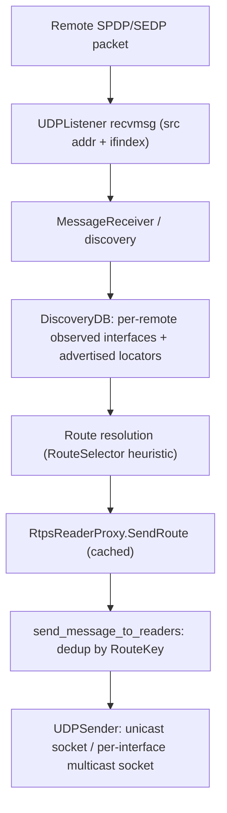

# Smarter Transmit: Interface-Aware Locator Selection

Status: design proposal (no implementation yet).

This document describes how to replace RustDDS's current "send to everything"
transmit strategy with a precomputed, interface-aware locator-selection
algorithm that avoids unnecessary duplicate sends while preserving reachability
and correctness.

The relevant code today lives in
[`writer.rs`](writer.rs) (`send_message_to_readers`),
[`rtps_reader_proxy.rs`](rtps_reader_proxy.rs) (per-reader locator lists),
[`../network/udp_sender.rs`](../network/udp_sender.rs),
[`../network/udp_listener.rs`](../network/udp_listener.rs), and
[`../discovery/spdp_participant_data.rs`](../discovery/spdp_participant_data.rs).

## 1. Purpose and scope

Replace the self-labelled "stupid transmit algorithm" (TODO comment in
[`writer.rs`](writer.rs) around lines 1203-1205) with a design that:

- picks one multicast route and one unicast route per remote, instead of
  blasting every advertised locator;
- makes multicast interface-aware, so reaching one remote does not require
  sending on every local interface;
- precomputes routes on discovery updates, not on every transmit;
- keeps cross-remote de-duplication (one datagram serves all remotes reachable
  behind the same interface + address);
- leaves a clean seam for a route-selection heuristic when a remote is
  reachable via multiple interfaces;
- reuses the existing multicast-vs-unicast preference logic.

Scope of this document is design only. No behavior changes are implied by
merging it.

## 2. Current behavior (baseline)

- `send_message_to_readers` ([`writer.rs`](writer.rs) ~1197-1268): for each
  message, for each `RtpsReaderProxy`, it dynamically chooses multicast-or-unicast
  and then sends to *every* locator in that list. `already_sent_to:
  BTreeSet<Locator>` de-duplicates only within a single send call.
- Reader-proxy locators (`unicast_locator_list`, `multicast_locator_list`) come
  only from the advertised SEDP/SPDP payload
  ([`rtps_reader_proxy.rs`](rtps_reader_proxy.rs)
  `from_discovered_reader_data` / `update`; participant `default_*` /
  `metatraffic_*` locators in
  [`../discovery/spdp_participant_data.rs`](../discovery/spdp_participant_data.rs)).
- Outbound multicast replicates over *all* interface sockets (`multicast_sockets`
  in [`../network/udp_sender.rs`](../network/udp_sender.rs) ~140-148). There is
  no API to target a single interface.
- The receive path discards origin information: `UDPListener::messages` uses
  `socket.recv()` (not `recv_from`) in
  [`../network/udp_listener.rs`](../network/udp_listener.rs) ~266; the four
  listeners (discovery/user x unicast/multicast) are not per-interface (the
  multicast listener joins all interfaces). As a result, the local interface and
  the source address on which a remote's discovery arrived are *not available
  today*.
- Delivery mode is chosen per call: DATA / HEARTBEAT prefer Multicast; repair and
  directed sends use Unicast ([`writer.rs`](writer.rs) ~512, 564, 568, 652, 796,
  997, 1060).

## 3. Problems

- Duplicate unicast sends to every advertised address of a remote.
- Multicast fan-out over every local interface even when the remote is on one.
- The route is recomputed on every transmit.
- No knowledge of which interface actually reaches a given remote.

## 4. Proposed design

### 4.1 Core concept: a precomputed `SendRoute` per reader proxy

Introduce a `SendRoute` (resolved destination) computed once per discovery
update and cached on the `RtpsReaderProxy`:

- `unicast: Option<Locator>` -- the single chosen unicast destination.
- `multicast: Option<(Locator, InterfaceSelector)>` -- the chosen multicast group
  plus the local egress interface to use.
- `alternates: Vec<...>` (optional) -- for the multi-path heuristic (Section 4.5).

`send_message_to_readers` then only iterates precomputed routes and de-duplicates
by a `RouteKey` (Section 4.4). It performs no list scanning or mode logic beyond
honoring `preferred_mode`.

### 4.2 Interface-aware multicast

- Model a local multicast egress as an `InterfaceSelector` (interface IP or OS
  interface index).
- `UDPSender` today keeps an unkeyed `Vec` of per-interface multicast sockets.
  The design keys them by interface so the sender can emit on exactly one
  interface, e.g. `send_to_multicast(buffer, group, interface)`.
- Route resolution assigns each remote the interface on which its discovery was
  observed (Section 4.3). When that is unknown, it falls back to "all interfaces"
  (preserving current reachability).

### 4.3 Prerequisite capability: learn the receiving interface / source

This is the enabling change the design depends on, and it is currently missing.

- Capture, per received datagram, the source `SocketAddr` and the local receiving
  interface. On Linux and most Unix systems this is `recvmsg` +
  `IP_PKTINFO` / `IPV6_PKTINFO` (control message `ipi_ifindex` / `ipi_spec_dst`).
  A portable fallback is `recv_from` for the source address plus best-effort
  interface inference.
- Thread this origin metadata from `UDPListener` into `MessageReceiver` and then
  into SPDP handling, and record it per remote participant in the discovery DB:
  the set of `(local_interface, remote_source_addr)` observations from that
  participant's SPDP. This is a new, dedicated metadata channel and must be added
  to the receive path.
- Important distinction: the existing `unicast_reply_locator_list` /
  `multicast_reply_locator_list` fields in `MessageReceiverState`
  ([`message_receiver.rs`](message_receiver.rs) ~71-77) are **not** related to
  this feature. They carry the reply-locator lists announced via the RTPS
  `InfoReply` submessage, whose purpose is to tell the receiver a (possibly
  different) locator list to reply to -- for example to relay or forward RTPS
  submessages on behalf of another participant. They are transport-independent,
  submessage-level data and must not be conflated with the observed local
  interface / source address introduced here.
- The observed interface is the primary input for choosing the multicast egress
  and for ranking unicast candidates. Degrade gracefully: if it is unavailable,
  behavior falls back to today's all-interfaces semantics.

### 4.4 De-duplication across remotes

- Compute a `RouteKey`:
  - unicast: the destination `Locator` (address + port);
  - multicast: `(group Locator, InterfaceSelector)`.
- A single `send_message_to_readers` pass collects the `RouteKey`s of all target
  readers into a set and emits each datagram once. Multiple remotes sharing a
  multicast group on the same interface produce one packet; remotes sharing a
  unicast endpoint produce one packet.

### 4.5 Multiple reachable interfaces (heuristic seam)

- When discovery for a remote is observed on more than one local interface (both
  hosts multi-homed), store all observed routes and select one via a pluggable
  `RouteSelector` policy.
- Document a conservative default heuristic, e.g. prefer the interface with the
  most recent / most frequent SPDP, prefer non-loopback, prefer a matching subnet
  or lowest metric. Leave the trait / function seam for future policies.
- Record the decision on the proxy so transmit stays O(1).

### 4.6 Reuse of multicast-vs-unicast preference

- Keep the existing `DeliveryMode` preference and the current match precedence
  (multicast when a multicast route exists in multicast mode; otherwise unicast;
  repair and directed sends forced to unicast). The only change is *which*
  concrete locator / interface each mode resolves to (a single chosen route
  rather than the whole list).

### 4.7 Recompute triggers (not per transmit)

Recompute `SendRoute` on:

- reader / participant discovery add or update;
- a new interface observation for a remote;
- local interface-set changes.

Hook points: `update_reader_proxy` / `matched_reader_update`
([`writer.rs`](writer.rs) ~1286) and the discovery propagation flow in
[`dp_event_loop.rs`](dp_event_loop.rs) (~636-685 and ~800-802).

### 4.8 Correctness, fallbacks, compatibility

- Never send to fewer places than needed for reachability: when the interface or
  source is unknown, fall back to all-interfaces multicast and (optionally) all
  advertised unicast, matching today's behavior.
- Retain loopback filtering (`not_loopback`) and `Locator::is_udp` gating.
- Interop risks to document and handle conservatively: peers only reachable via a
  non-observed interface, asymmetric routing, and NAT.

## 5. Data flow

## 6. Non-goals and open questions

- Open questions:
  - exact `InterfaceSelector` representation (interface IP vs OS index) and
    Windows parity for `IP_PKTINFO`;
  - whether to also prune redundant unicast when multicast already covers a
    remote;
  - the specifics of the default `RouteSelector` policy.

## 7. Implementation notes (as built)

- `InterfaceSelector` is the interface IP (`InterfaceSelector::Ip(IpAddr)`),
  matching the address the multicast sender sockets are bound to. The enum keeps
  room for an OS-index variant.
- Receive origin is captured in [`udp_listener.rs`](../network/udp_listener.rs)
  via `recvmsg` + `IP_PKTINFO` (Unix; `nix` crate). For IPv4 the local interface
  is taken directly from `ipi_spec_dst`; `ipi_ifindex` is resolved through a
  cached index→interface map as a fallback. On non-Unix platforms only the
  source address is captured (`local_if = None`), which keeps the fallback path.
- Observations live in `InterfaceObservations`, shared intra-thread via
  `Rc<RefCell<..>>` between `MessageReceiver` (writer) and `DPEventLoop`
  (consumer). Cleared on `remote_participant_lost`.
- Routes are resolved in `matched_reader_update` (on discovery add/update) and
  refreshed in `Writer::recompute_routes_for`, invoked from `update_participant`
  when fresh SPDP traffic may have changed observations.
- The default policy is deliberately conservative: unknown/ambiguous → fallback
  (legacy all-locators/all-interfaces path), so the feature is a strict
  optimization for peers whose receive interface we have positively observed.

## 8. Manual multi-homed validation

CI runs on single-interface hosts, which exercise the fallback and the
narrowed-but-single-interface paths, but cannot prove interface selection across
multiple interfaces. To validate that manually:

1. Set up two hosts, each connected to two separate subnets (e.g. host A on
   `10.0.0.0/24` and `192.168.50.0/24`; host B likewise), so each participant is
   reachable via two interfaces.
2. Optionally emulate this on one machine with two network namespaces or two
   `veth`/dummy interfaces on different subnets, both multicast-capable, and run
   a publisher in one namespace and a subscriber in the other.
3. Run a reliable publisher on A and subscriber on B:
   - `shape_main -P -t Square -c BLUE -r` on A,
   - `shape_main -S -t Square -r` on B.
4. Capture traffic on each interface (`tcpdump -ni <iface> udp`). Expected: after
   discovery converges, DATA/HEARTBEAT for a given remote is emitted on a single
   interface (the one its SPDP/SEDP arrived on), not duplicated across both.
5. Bring the observed interface down mid-run; the next discovery refresh should
   re-resolve the route to the surviving interface (or fall back to all
   interfaces until a new observation is made), and delivery should continue.
6. Sanity: with `RUST_LOG=trace`, "Already sent to ..." trace lines confirm
   `RouteKey` de-duplication across readers sharing a destination.
